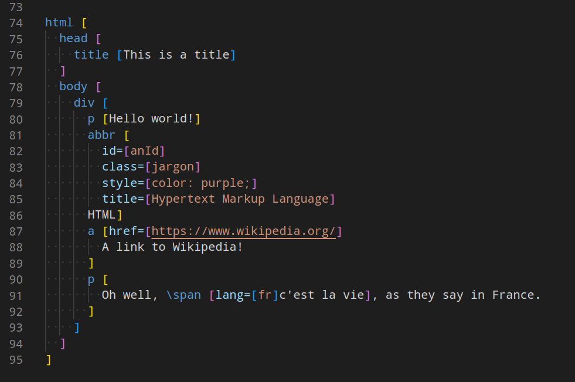

# jevkoml

Converts JevkoML -- a [Jevko](https://jevko.org) markup format -- to HTML or XML.

Compared to HTML or XML, JevkoML is delightful to write, edit, or generate -- by hand or otherwise.

JevkoML can make authoring and maintaining HTML documents, XML configurations, SVG graphics, and countless other XML-based formats much more pleasant.

<!-- In the future, JevkoML could also be used directly by various tools, for increased efficiency. -->

## Example

For example, JevkoML can convert something like this:

<!-- [ ] see a version with syntax highlighting (htmlpreview), [x] get a syntax highlighting extension for visual studio code -->



into something like this:

```HTML
<html>
  <head>
    <title>This is a title</title>
  </head>
  <body>
    <div>
      <p>Hello world!</p>
      <abbr
        id="anId"
        class="jargon"
        style="color: purple;"
        title="Hypertext Markup Language"
      >HTML</abbr>
      <a href="https://www.wikipedia.org/">
        A link to Wikipedia!
      </a>
      <p>
        Oh well, <span lang="fr">c'est la vie</span>, as they say in France.
      </p>
    </div>
  </body>
</html>
```

See [jevkoml.md](jevkoml.md) for details.

Also see the [JevkoML syntax highlighting extension for Visual Studio Code](https://github.com/jevko/jevkoml-basic-highlighting-vscode) which was used to produce the screenshot above.

## Usage

If `jevkoml` is [installed](#installation-with-deno) you can invoke it as:

```
jevkoml
```

Without arguments, `jevkoml` will accept input from standard input until you press CTRL+D.

<!-- todo?: mvp console highlighting? -->

You can also provide a path to a file as an argument:

<!-- get syntax highlighting for vscode -->

```
jevkoml filename.jevkoml
```

This will convert a file named `filename.jevkoml` into HTML and output the result to standard output.

To output to a file instead of the standard output, you can either use the redirect facility of your shell:

```
jevkoml filename.jevkoml > outputfile.html
```

Or you can put an `/output` directive with the output file name at the top of the input file:

```
/output [outputfile.html]
```

now if you run:

```
jevkoml filename.jevkoml
```

it will output to `outputfile.html` instead of standard output.

## Dependencies

`jevkoml` has one dependency: [Deno](https://deno.land/).

Fortunately Deno is very nice and [easy to install](https://deno.land/manual@v1.28.1/getting_started/installation).

<!-- I recommend installing it, as it makes installing and managing `jevkoml` easy and efficient. -->

## Installation with Deno

These instructions will guide you through using Deno to install `jevkoml` as a command in your system, so that you can invoke it from anywhere.

If you have [Deno installed](#dependencies) and Deno's installation root's bin directory (something like `/home/USER/.deno/bin`) [added to `PATH`](#tip-get-a-list-of-directories-in-your-path) then you can use the following command to install `jevkoml` directly from GitHub:

```
deno install --allow-read --allow-write --allow-run https://raw.githubusercontent.com/jevko/jevkoml/master/jevkoml.js
```

Note: if you haven't added Deno's installation root to `PATH`, then `jevkoml` won't be recognized as a command.

### Alternative: install without editing PATH

If you can't or prefer not to change your `PATH`, you can alternatively install `jevkoml` to a [directory that is already in the `PATH`](#tip-get-a-list-of-directories-in-your-path), by adding the `--root` option to `deno install`. E.g. if your `PATH` contains `~/.local/bin`, then you can run:

```
deno install --root ~/.local/ --allow-read --allow-write --allow-run https://raw.githubusercontent.com/jevko/jevkoml/master/jevkoml.js
```

to install `jevkoml` under `~/.local/bin`.

## Tip: get a list of directories in your PATH

You can get a list of directories in your `PATH` by running:

```
echo $PATH
```

This should print something like:

```
/home/USER/.local/bin:/usr/local/bin:/usr/bin:/bin:/usr/local/sbin
```

# Features coming soon

* XML literals